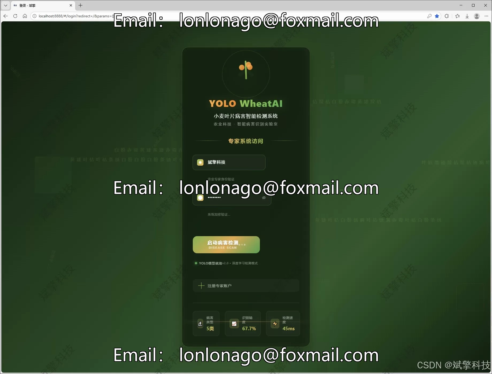
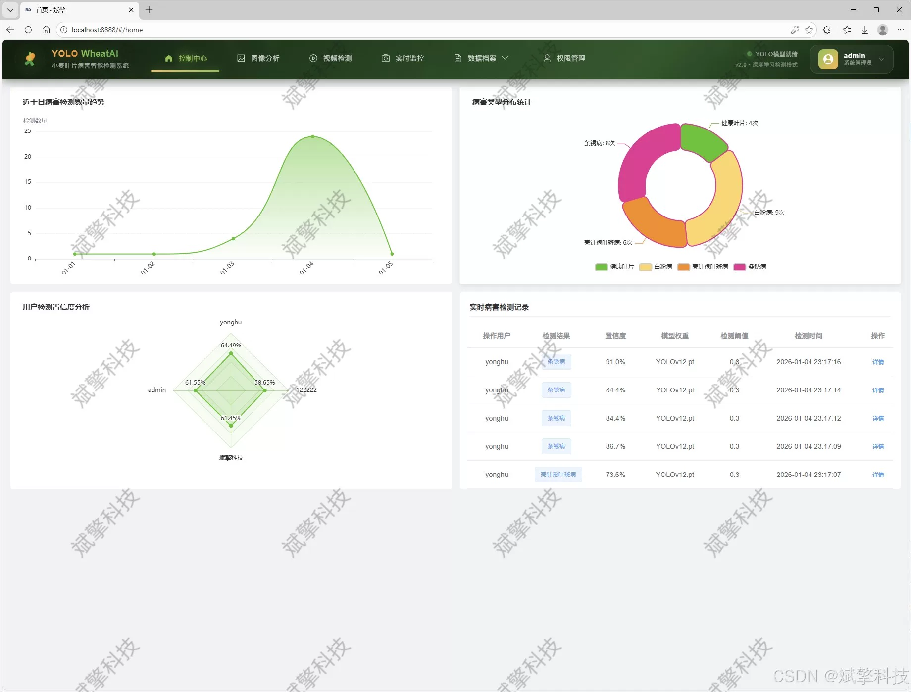
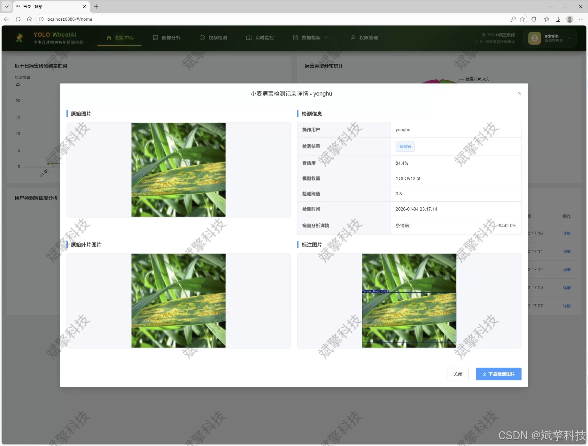
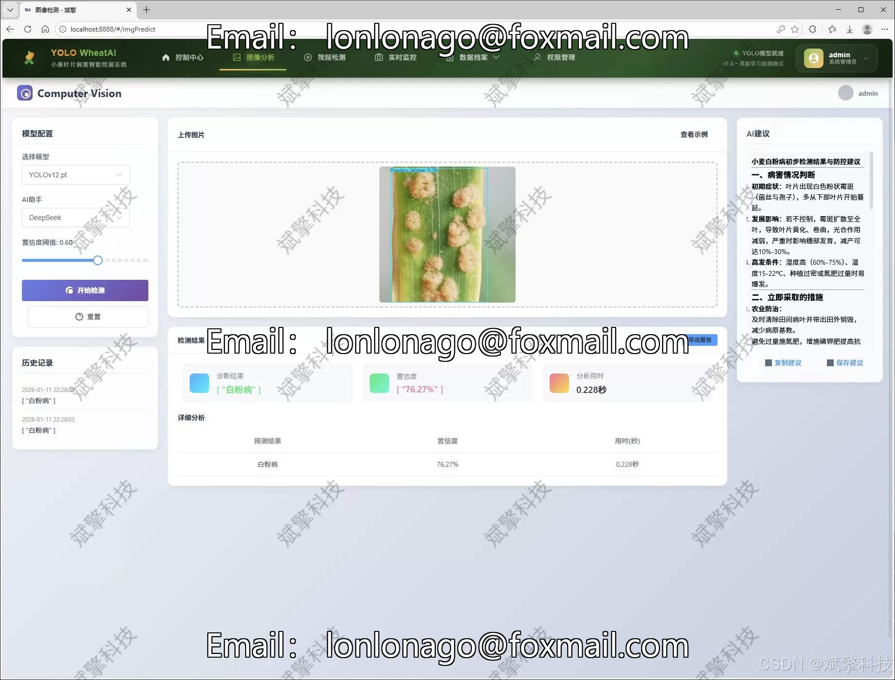
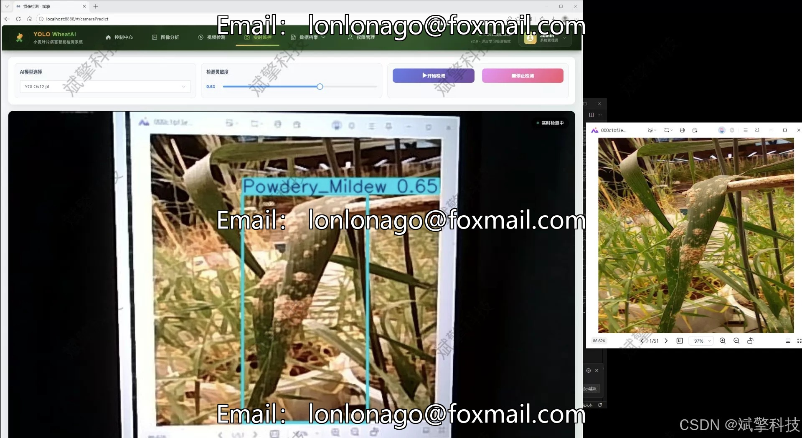
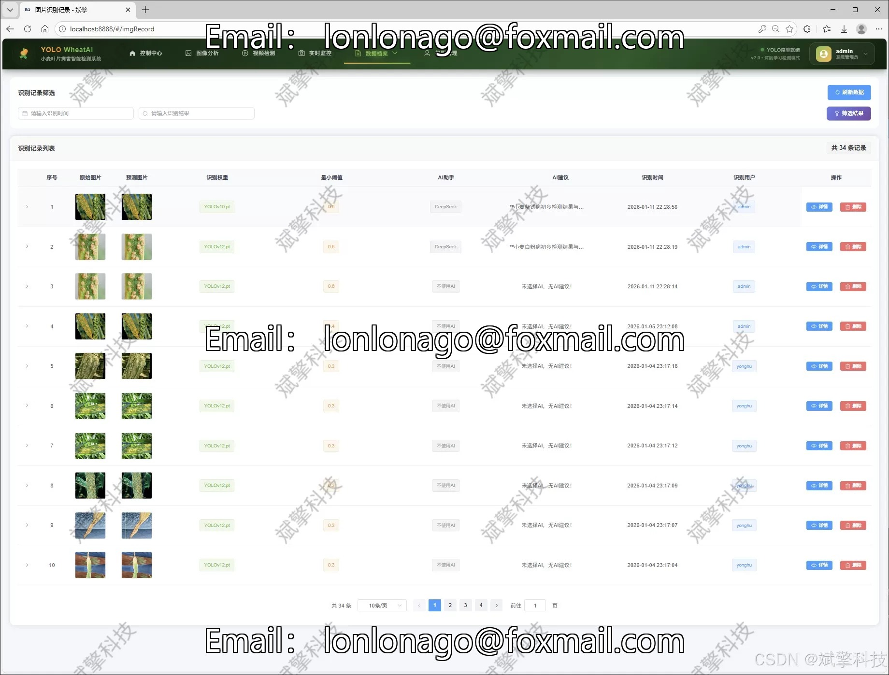
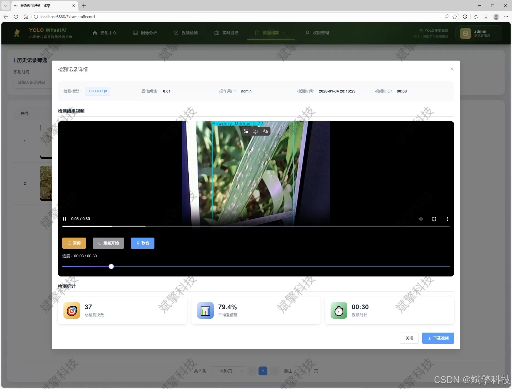
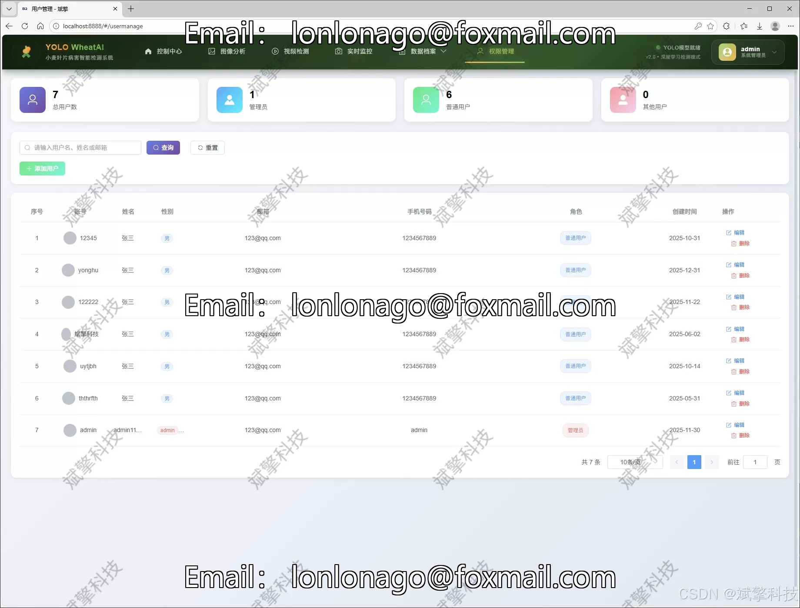
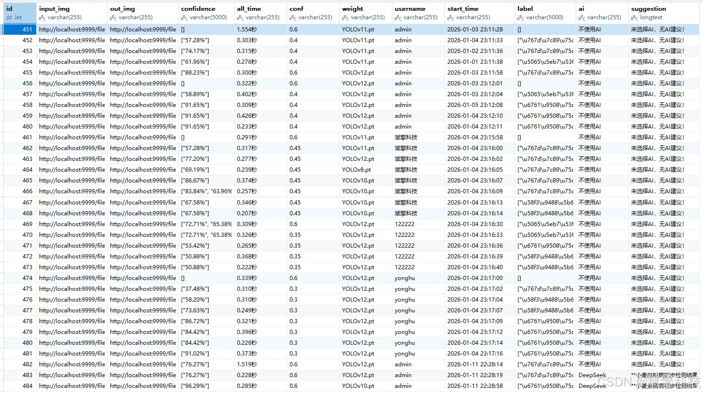

# YOLO series wheat disease intelligent detection system

## Body

The YOLO series wheat disease intelligent detection system is based on the YOLO deep learning and the large models of Qianwen and DeepSeek for the detection of wheat leaf diseases (DeepSeek intelligent analysis + web interaction interface + front-end separation + YOLO data + YOLOv8/YOLOv10/YOLOv11/YOLOv12).

With the rapid development of deep learning and computer vision technology, especially the target detection algorithm represented by YOLO series, it provides a revolutionary solution for intelligent disease detection in the field of agriculture. The YOLO algorithm, with its "you only need to look once" real-time detection feature, can achieve rapid image target recognition under the premise of high accuracy, perfectly meeting the needs of rapid screening of diseases in the field.

At the same time, the separation of frontend and backend in modern software engineering and the maturity of Web interaction technology make it possible to encapsulate powerful AI model capabilities into easy-to-use, manageable, and scalable online services. SpringBoot, as a popular back-end framework in the Java ecosystem, provides a solid foundation for building robust enterprise-level application backends with its simplified configuration and powerful features.

This project was born in this background. We designed and implemented a "Wheat Leaf Disease Intelligent Detection and Management System based on YOLOv8/YOLOv10/YOLOv11/YOLOv12 and SpringBoot". This system deeply integrates the cutting-edge YOLO series object detection models, modern Web development architecture, and the intelligent analysis capabilities of DeepSeek large language model, aiming to build a comprehensive smart agriculture platform that integrates automatic disease identification, multimodal detection entry, intelligent result interpretation, data visualization management, and user collaboration.

Functional module

✅ User Login and Registration: Supports password detection, saves to MySQL database.

✅ Supports four YOLO model switches, YOLOv8, YOLOv10, YOLOv11, YOLOv12.

✅ Information Visualization, Data Visualization.

✅ Image detection supports AI analysis functions, deepseek and Qianwen.

✅ Supports image detection, video detection, and real-time camera detection. The results are saved to a MySQL database.

✅ Picture recognition record management, video recognition record management and camera recognition record management.

✅ User Management Module, administrators can add, delete, modify, and query users.

✅ Personal center, can modify their own information, password name profile picture and so on.

There is no Lunwen writing service, nor any Lunwen.

## Images

## Payment

Here is a pay link on Stripe ( https://buy.stripe.com/3cs8yP7sY87d0vu9AB ). Please contact me lonlonago@foxmail.com after funding $89, and I will send you a complete data files , thank you!

